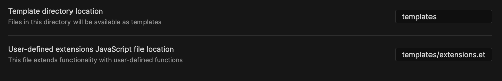

# Obsidian YAML front matter template plugin

## Introduction

This is a plugin used to create templates for [Obsidian](https://obsidian.md). The active file's YAML front matter is passed as data to a template engine.

The default Obsidian template feature allows users to have `{date}`, `{time}` and `{title}` placeholders in their templates. When the insert template command is run the placeholders are resolved to the current date and time, respectively.

The YAML front matter template plugin also has an insert template command, but instead of using fixed placeholders users can define their own variables and control structures (loop, functions, etc.).

The only supported template engine is [Etajs](https://eta.js.org/) (this may change in the future). Etajs biggest benefit is that it's _extremely_ fast. Dates can be manipulated using the [date-fns](https://date-fns.org/) library.

The plugin has support for user-defined global helper functions/objects/attributes. These properties can be defined in a single file and used in all subsequent templates.

## Compatibility

Requires Obsidian v0.10.2 or above to work properly.

## Installation

You can install the plugin via the Community Plugins tab within Obsidian. Search for "Template".

You can also manually install the plugin from the [releases](https://github.com/m-orfanos/obsidian-yfm-templater-plugin/releases) page. Copy over main.js and styles.css to your vault `VaultFolder/.obsidian/plugins/obsidian-yfm-templater-plugin/`.

## Settings



| Setting                                          | Example value               |
| ------------------------------------------------ | --------------------------- |
| Template directory location                      | templates                   |
| User-defined extensions JavaScript file location | templates/extensions.eta.js |

## Usage

This section assumes the plugin settings have been configued properly.

### Basic example

#### Create a note which will act as the template

`template.md`

```markdown
<% it.today %>
```

#### Create a note to insert the template into

`note.md`

```markdown
---
today: "2020-12-30"
---

This is existing content
```

#### Open the Command Palette, search for the plugin, select the "insert" command


#### Select the template you created above


#### Final result

`note.md`

```markdown
---
today: '2020-12-30' <!-- This is a string NOT a Date -->
---

This is existing content

2020-12-30
```

### Intermediate example using loops and functions

See the Basic example above first.

#### Create a Template

`template.md`

```markdown
<%
function days(start, end) {
    // Note the `it` variable
    return it.dateFns.eachDayOfInterval({
        start: start,
        end: end
    });
}
function getEnd() {
    return it.dateFns.add(it.date, { days: 6 });
}
%>

## Weekly Review

<!-- Note the `-` character, w/o it a newline would be added for every item -->

<% days(it.date, getEnd()).forEach(function(date) { -%>
- [[<%= it.dateFns.format(date, 'yyyy-MM-dd') %>]]
<% }) %>
```

#### Create a Note, run the plugin's insert command and select the template (intermediate)

`note.md`

```markdown
---
date: 2020-12-28T05:00:00.000Z <!-- This is a Date object, the timezone is required -->
---

This is existing content
```

#### Final Result

`note.md`

```markdown
---
date: 2020-12-28T05:00:00.000Z
---

This is existing content

## Weekly Review

- [[2020-12-28]]
- [[2020-12-29]]
- [[2020-12-30]]
- [[2020-12-31]]
- [[2021-01-01]]
- [[2021-01-02]]
- [[2021-01-03]]
```

### Advanced example using user-defined global functions

#### Create global extension

`extensions.js`

```js
function days(start, end) {
  // Note the `it` variable is not used here
  return dateFns.eachDayOfInterval({
    start: start,
    end: end,
  });
}

// export functions
(function () {
  return {
    days,
  };
})();
```

#### Create a Template (advanced)

`template.md`

```markdown
<%
function getEnd() {
    return it.dateFns.add(it.date, { days: 6 });
}
%>

## Weekly Review

<!-- Note the `-` character, w/o it a newline would be added for every item -->
<!-- Note the `it` variable, the `days` function is the extension defined above -->
<% it.days(it.date, getEnd()).forEach(function(date) { -%>
- [[<%= it.dateFns.format(date, 'yyyy-MM-dd') %>]]
<% }) %>
```

#### Create a Note, run the plugin's insert command and select the template (advanced)

`note.md`

```markdown
---
date: 2020-12-28T05:00:00.000Z <!-- This is a Date object, the timezone is required -->
---

This is existing content
```

#### Final Result (advanced)

`note.md`

```markdown
---
date: 2020-12-28T05:00:00.000Z
---

This is existing content

## Weekly Review

- [[2020-12-28]]
- [[2020-12-29]]
- [[2020-12-30]]
- [[2020-12-31]]
- [[2021-01-01]]
- [[2021-01-02]]
- [[2021-01-03]]
```
