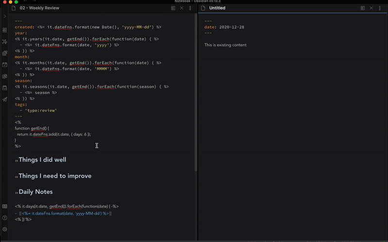

# Example with user-defined extensions

Configure the `template` directory and `extensions` file plugin settings.

- Place [template](template.md) in the `templates` directory you defined above.
- Place [user extensions](extensions.eta.js) in the directory you defined above.
- Open [note before](note-before.md) in Obsidian
- Run the plugin's insert command, choose the template above.
- The result of the operation is in shown [note after](note-after.md)

